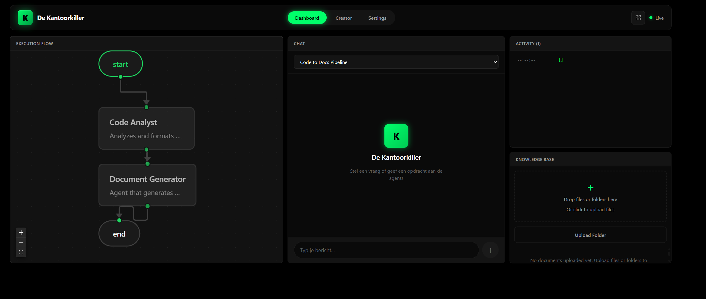
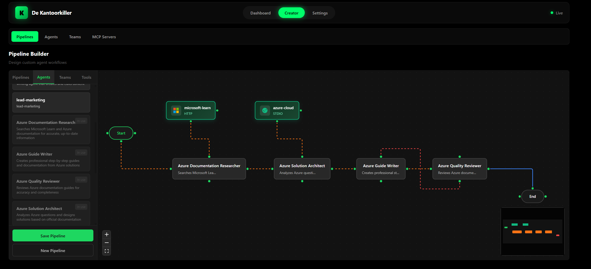

# De Kantoorkiller

A visual multi-agent AI system where you can build pipelines by dragging and dropping agents together. Connect them to MCP servers, add a knowledge base, and let them collaborate on tasks.



## What is this?

This started as a hobby project to learn LangGraph and ended up becoming a full pipeline builder. You can:

- Create custom AI agents with different roles (researcher, coder, writer, etc.)
- Build pipelines by connecting agents visually
- Add MCP servers for external tools (GitHub, databases, file systems)
- Upload documents to a knowledge base that agents can search
- Run everything locally with Ollama or use OpenAI/Anthropic/Google



## Requirements

- Python 3.14+
- Node.js 24+ (for frontend)
- Docker (optional)

## Quick Start

### Local (easiest)

```bash
# Clone and setup
git clone https://github.com/yourusername/pipeline-agent-builder.git
cd pipeline-agent-builder

# Create .env from example
cp .env.example .env
# Edit .env and add your API key

# Install dependencies
pip install -r requirements.txt

# Run the API
python run.py
```

Then open the frontend:

```bash
cd frontend
npm install
npm run dev
```

Go to `http://localhost:3000`

### Docker

```bash
# With OpenAI/Anthropic
docker compose up

# Fully local with Ollama (no API keys needed)
docker compose -f docker-compose.yml -f docker-compose.local.yml up
```

## Configuration

Copy `.env.example` to `.env` and set your provider:

```bash
PROVIDER=openai          # or anthropic, google, ollama
OPENAI_API_KEY=sk-...    # your key here
DEFAULT_MODEL=gpt-4o
```

For local models with Ollama, just set `PROVIDER=ollama` and it handles the rest.

## Project Structure

```
src/
├── agents/          # Base agent, supervisor, reflective agents
├── api/             # FastAPI routes and WebSocket
├── graph/           # LangGraph workflow and pipeline builder
├── knowledge/       # Document ingestion and retrieval
├── mcp/             # MCP server integration
├── memory/          # ChromaDB vector store, checkpointing
├── storage/         # SQLAlchemy models and repository
└── tools/           # Search, code execution, documents

frontend/            # Next.js dashboard
docker/              # Database init scripts
```

## Tech Stack

**Backend**: Python 3.14, LangGraph, LangChain, FastAPI, SQLAlchemy, ChromaDB

**Frontend**: Next.js, TypeScript

**Providers**: OpenAI, Anthropic, Google, Ollama

**Infrastructure**: PostgreSQL (with pgvector), ChromaDB, Docker

## Features

- **Visual Pipeline Builder** - Drag and drop agents, connect them with edges, add conditions
- **Agent Teams** - Group agents that work together on subtasks
- **MCP Integration** - Connect to any MCP server (GitHub, Postgres, filesystem, etc.)
- **Knowledge Base** - Upload PDFs, docs, code files. Agents search automatically
- **Human-in-the-Loop** - Add approval nodes, feedback loops, edit steps
- **Checkpointing** - Pause and resume workflows, conversation memory
- **Code Execution** - Sandboxed Python execution via E2B

## API

The backend exposes a REST API at `http://localhost:8080`:

- `POST /api/task` - Submit a task
- `GET /api/agents` - List available agents
- `POST /api/pipelines` - Create a pipeline
- `POST /api/knowledge/upload` - Upload documents
- `GET /api/mcp/servers` - List MCP servers

WebSocket at `/ws/{thread_id}` for real-time streaming.

## Development

```bash
# Run tests
pytest tests/ -v

# Lint
ruff check src/ tests/

# Type check
mypy src/ --strict
```

## Disclaimer

This is a hobby project, built for fun and learning. It works, but don't expect enterprise-grade stability. Use at your own risk.

## License

MIT
